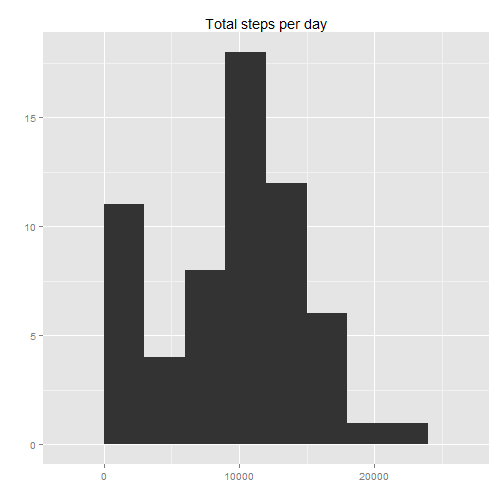
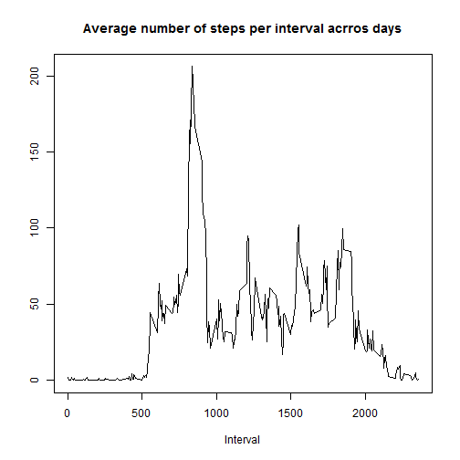
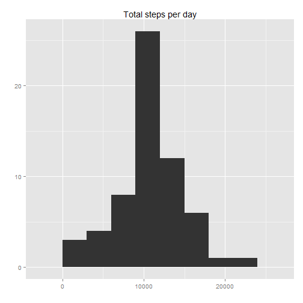
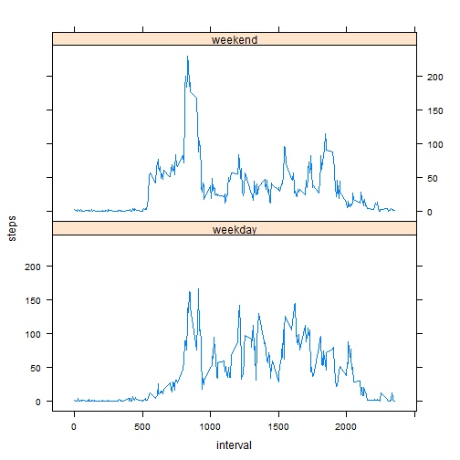

Analizing activity data from motinoring activity devices
========================================================

In this assignment we are going to compute basic statistics from a data set monitoring steps from a person in 5-minutes intervals during the months of October and November, 2012

### Loading the data

Loading the data and setting global parameters


```r
opts_chunk$set(echo=TRUE)
options(scipen=10)
setwd("C:/Users/Marttín/Desktop/Data Science/Reproductible research/project1/RepData_PeerAssessment1")

library(ggplot2)
```

```
## Warning: package 'ggplot2' was built under R version 3.0.3
```

```r
lct <- Sys.getlocale("LC_TIME"); Sys.setlocale("LC_TIME", "C")
Sys.setlocale("LC_TIME", lct)
library(lattice)
```

```
## Warning: package 'lattice' was built under R version 3.0.3
```

```r
library(reshape2)
```

```
## Warning: package 'reshape2' was built under R version 3.0.3
```


```r
activity<-read.csv(unzip("activity.zip"))
```
### Formatting the data

We want steps to be numeric and date formatted in date format

```r
activity$steps<-as.numeric(activity$steps)
activity$date<-as.Date(activity$date, format="%Y-%m-%d")
```

### What is mean total number of steps taken per day?

The aggregation is done using the tapply function. The NAs are removed


```r
stepsPerDay<-with(activity, tapply(steps, date, sum, na.rm=T))
averageSteps<-round(mean(stepsPerDay, na.rm=T),1)
medianSteps<-median(stepsPerDay, na.rm=T)
qplot(stepsPerDay, main="Total steps per day", xlab="", ylab="",binwidth=3000)
```

 

The total steps per day mean is 9354.2 and the median is 10395.

### What is the average daily activity pattern?

We present now the time series plot with the 5-min interval average steps taken across days

```r
intervalMeans<-with(activity, tapply(steps, interval, mean, na.rm=T))
with(activity, plot(unique(interval), intervalMeans, type="l",
                    main="Average number of steps per interval acrros days",
                    xlab="Interval", ylab=""))
```

 

Lets now copmute the 5-minute interval that contains the maximun number of steps avverages accross days

```r
max.steps<-unique(activity$interval)[which.max(intervalMeans)]
```

The 835 5-minute interval contains the maximum number of steps averaged across days

### Imputing missing values

First, we check how many missing values we have in the dataset

```r
missing<-sum(!complete.cases(activity))
nobs<-nrow(activity)
percent<-round(missing/nobs*100,1)
```

The total number of rows with missing values in the dataset is 2304, a 13.1% of the total number of observations

We create now a new dataset in wich We'll fill the missing values with the corresponding 5-min interval averanged across days.


```r
activity.new<-activity
for (i in seq_along(activity$steps)){      
        if (is.na(activity$steps[i])){
                activity.new$steps[i]<-intervalMeans[names(intervalMeans) %in% activity$interval[i]]}}
```

With this new data we compute again the mean and median of total number of steps taken per day


```r
stepsPerDay.new<-with(activity.new, tapply(steps, date, sum))
averageSteps.new<-round(mean(stepsPerDay.new),1)
medianSteps.new<-median(stepsPerDay.new)
qplot(stepsPerDay.new, main="Total steps per day", xlab="", ylab="",binwidth=3000)
```

 

The total steps per day mean is 10766.2 and the median is 10766.1887. Both the mean and the median have experimented an increase. Adittionaly, the assimetry has been removed from the distribution, since there are less days with a total number of steps equal to 0. This simetry in the form of the new distribution is reafirmed by the fact that now the mean is very close to the median.

### Are there differences in activity patterns between weekdays and weekends?

First, we create a new factor variable specifying the days of the week


```r
activity.new$weekdays<-!weekdays(activity.new$date) %in% c("sábado", "domingo")
activity.new$weekdays<-as.factor(activity.new$weekdays)
levels(activity.new$weekdays)<-c("weekday", "weekend")
```

Then we compute the average number steps for each interval accross days, for weekdays and weekends. In order to make a plot using weekdays variable as a factor we reshape de data.frame with the reshape2 package


```r
actMelt<-melt(activity.new, id=c("interval", "weekdays"), measure.vars="steps")
actMelt<-dcast(actMelt, weekdays+interval ~ variable, mean)
head(actMelt)
```

```
##   weekdays interval    steps
## 1  weekday        0 0.214623
## 2  weekday        5 0.042453
## 3  weekday       10 0.016509
## 4  weekday       15 0.018868
## 5  weekday       20 0.009434
## 6  weekday       25 3.511792
```

Finally, we imput the computing means separated by weekdays

```r
xyplot(steps~interval| weekdays, actMelt, ty="l", layout=c(1,2))
```

 


The main difference between the weekdays and weekdens is the peak in weekends aroud the 800 interval, and also greater values in weekday between intervals 1000 and 1500.
